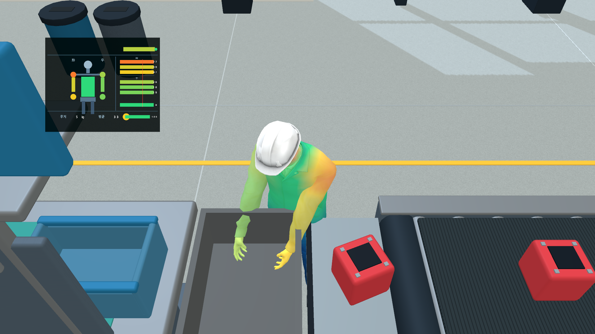

# 사람형 아바타와 제3자 촬영

작업 장면은 `Assets/Factory/Scenes/SmartFactory_QuestTask.unity`입니다. 기존 공장과 작업 기능을 사용하며 XR Rig, 입력 시스템, 부하 계산기는 각각 하나입니다. Unity 6000.3.25f1 / URP 17.3 / OpenXR 1.16.1 / Input System 1.20을 사용합니다. Meta XR SDK나 XR Interaction Toolkit을 중복 설치할 필요가 없습니다.

## 포함된 작업자

파란 작업복·안전모·얼굴·손가락을 가진 Microsoft Rocketbox `Construction_Male_05` 모델을 이미 포함했습니다. 큐브/캡슐 조합이 아닌, 4,799개 정점의 리깅된 메시입니다. MIT 라이선스 사본은 `Assets/FactoryTask/Avatar/Rocketbox/LICENSE.md`에 있습니다.

빌드에도 라이선스와 출처를 포함하도록 `Assets/StreamingAssets/ThirdParty/`에 같은 고지문을 넣었습니다.

- 원본: https://github.com/microsoft/Microsoft-Rocketbox
- 고정 소스 커밋: `0943055db6ec570bcef9f2c8b41c9e5467c808f9`
- 원본 경로: `Assets/Avatars/Professions/Construction_Male_05/Export/Construction_Male_05.fbx`
- 로컬 FBX: `Assets/FactoryTask/Avatar/Rocketbox/Construction_Male_05.fbx`
- 로컬 텍스처: 같은 폴더의 `Textures/m104_body_color.tga`, `m104_head_color.tga`, `m104_helmet_color.tga` 및 normal 텍스처. 표시용 셰이더는 색상 텍스처를 사용합니다.
- 사용 Prefab: `Assets/FactoryTask/Avatar/Worker_Avatar.prefab`

본인과 똑같은 얼굴을 재현한 모델은 아닙니다. 머리와 양손만 직접 추적하고 팔꿈치·골반·허리·발은 추정합니다. 신발 바닥을 보정된 바닥 높이에 맞추고, 큰 위치 변화에는 좌우 발을 번갈아 옮기는 보간 동작을 넣었습니다. 손목 회전도 시각적으로 제한합니다. 하체 보행 모션 캡처는 아니므로 실기기 녹화에서 어색한 자세가 남을 수 있습니다. 부하 색은 근력·피로·관절각·RULA·REBA의 정확한 측정값이 아닌 `추정 상대부하`입니다. 화면에서는 7개 부위를 선으로 구분하고 초록·노랑·빨강 단계색으로 표시하며 부위 경계의 그라데이션은 사용하지 않습니다.

## 방법 A — PC에 연결해서 바로 OBS 녹화

1. PC에 Meta Quest Link를 설치하고 Quest 2를 연결합니다. USB Link 또는 사용 환경에 맞는 Air Link를 사용합니다. Meta Quest Link의 OpenXR 런타임을 활성화합니다. APK 설치 방식과 달리, 이 경로는 PC Unity가 앱을 실행합니다.
2. Unity에서 `SmartFactory_QuestTask`를 열고 Play를 누릅니다.
3. `Tools > Smart Factory > Avatar Demo > Open Spectator Window`를 누릅니다. `Factory Spectator` 탭을 바깥으로 드래그하면 독립 창으로 사용할 수 있습니다.
4. 헤드셋은 1인칭 작업 화면을, 이 창은 작업자 오른쪽 앞의 낮은 측면 시점에서 아바타·벨트→책상→바구니·부하 패널을 보여줍니다. 작업자 뒤의 조작 버튼은 이 화면에 렌더링되지 않습니다. 관찰 카메라는 1920×1080 RenderTexture에만 렌더링합니다. Quest 단독 빌드에서는 관찰 카메라를 꺼 추가 렌더 비용을 피합니다.
5. OBS의 Windows 버전을 https://obsproject.com/download 에서 설치합니다. `소스 + > 윈도우 캡처`에서 `Factory Spectator` 창을 선택하세요. 창을 찾지 못하면 Unity 창을 선택하거나 디스플레이 캡처 후 해당 영역을 자릅니다. `Game Capture`로 Quest 거울 화면을 잡지 않도록 주의하세요.
6. OBS의 기본/출력 해상도를 1920×1080, FPS를 30으로 설정합니다. Spectator 창의 `Clean view (F8)`을 누르면 편집용 버튼이 숨겨집니다. 같은 창에 포커스를 두고 F8을 누르면 다시 보입니다.
7. OBS에서 녹화 시작 → VR 작업 → 녹화 중지를 누릅니다. 영상 파일은 OBS가 저장합니다. `.fvr`은 영상이 아닌 동작 데이터입니다.

OBS 윈도우 캡처 공식 설명: https://obsproject.com/kb/window-capture-sources
Meta Link 개발 연결: https://developers.meta.com/horizon/documentation/unity/unity-link/

## 방법 B — 선 없이 Quest에서 작업하고 나중에 PC에서 재생

헤드셋 없이 먼저 미리 보려면 같은 재생 메뉴에서 `Documentation/Avatar/LatestVerifiedSession.txt`에 적힌 `.fvr` 예제 파일을 여세요. 이 파일은 자동 검증 중 합성 머리·손 입력으로 수행한 작업 기록입니다.

`Documentation/Avatar/LatestVerifiedSession.txt`의 예제는 자동 테스트용 합성 기록입니다. 배치가 바뀌기 전 Quest에서 녹화한 `.fvr`은 현재 장면의 물체 배치와 맞지 않을 수 있으므로 새 APK에서 다시 녹화하세요.

1. `Tools/Install-QuestTask.ps1`로 최신 APK를 설치합니다. 설치할 때 USB와 헤드셋의 USB 디버깅 승인이 필요합니다.
2. APK를 실행한 뒤에는 PC 케이블을 분리해도 됩니다. 정면을 보고 편하게 2초 서서 보정하면 동작 데이터 기록이 자동 시작됩니다.
3. 양손 Grip으로 부품을 집고, 오른쪽 완료 상자에 놓습니다. 왼손 Y 1초는 빈손 재보정, 오른손 B 1초는 동작 기록 중지/다시 시작입니다. B를 길게 누른 채로 여러 번 토글되지 않습니다.
4. 작업을 마치고 오른손 B를 1초 눌러 저장합니다. 앱이 일시 정지되거나 종료되어도 열린 기록을 닫습니다. 앱 재개 시 자동 기록은 새 파일로 이어집니다.
5. USB를 다시 연결하고 프로젝트 폴더 PowerShell에서 실행합니다.

```powershell
powershell -ExecutionPolicy Bypass -File Tools/Pull-QuestSessions.ps1
```

6. 기록이 `Recordings/Quest/FactorySessions`로 복사됩니다. Unity에서 Play를 끈 상태로 `Tools > Smart Factory > Avatar Demo > Replay Session File (No Headset)`를 선택하고 `.fvr` 파일을 엽니다. 헤드셋 없이 자동으로 Play 모드에 들어가 재생합니다. 편집 모드로 돌아오면 원래 XR 자동 실행 설정을 복구합니다.
7. `Factory Spectator` 창에서 Pause/Play, Restart를 사용할 수 있습니다. OBS로 이 창을 녹화하면 실제 수행한 동작·부품·부하 색상이 같은 시간축에서 재생됩니다. 새 라이브 작업으로 돌아갈 때는 Play를 종료한 뒤 다시 시작합니다.

OBS 없이 MP4 파일이 필요하면, 최신 Quest 기록을 복사한 뒤 Unity의 `Tools > Smart Factory > Avatar Demo > Export Latest Quest Spectator MP4`를 실행할 수도 있습니다. 출력은 `Recordings/Quest/Spectator`에 1280×720/15fps로 만들어집니다. 이 자동 내보내기는 **기록 당시의 작업 위치가 현재 장면과 다르거나 책상 높이를 저장하지 않은 구형 기록이면 거부**합니다. 구형 `.fvr`을 새 장면에 억지로 재생하면 사람·책상·부품 좌표가 어긋나거나 상자가 책상 아래로 보일 수 있으므로, 최신 APK를 설치하고 새 작업 기록을 만든 다음 다시 가져와야 합니다.

헤드셋 저장 위치: `/sdcard/Android/data/com.nova.smartfactory.questtask/files/FactorySessions`.
PC 라이브 기록 위치는 `Application.persistentDataPath/FactorySessions`이며, 일반적으로 `%USERPROFILE%/AppData/LocalLow/<CompanyName>/NOVA Factory Task/FactorySessions`입니다.
30Hz 고정 크기 이진 프레임을 순차 저장합니다. 머리·양손 포즈, 추적 여부, Grip, 보정 기준, 부품 위치·무게·상태, 책상 실측 높이·벨트 속도, 좌우 완료 횟수와 7개 부하를 포함합니다. 개인 동작 데이터는 로컬에만 저장합니다.

## 다른 현실적인 FBX로 교체

지금은 추가 모델 다운로드가 필요 없습니다. 원하는 모델이 생기면 다음처럼 교체합니다.

1. `Assets/FactoryTask/Avatar/Custom/`에 FBX와 텍스처를 함께 넣습니다. Unity용 미터 단위, 정면 +Z, Y-up, 손가락 포함 리깅 모델을 사용하세요.
2. FBX Inspector의 Rig에서 `Animation Type = Humanoid`, `Avatar Definition = Create From This Model` → Apply → Configure에서 뼈 연결이 유효한지 확인합니다. Hips, Spine, Chest, Head, 양쪽 UpperArm/LowerArm/Hand, UpperLeg/LowerLeg/Foot가 필요합니다.
3. Materials에서 기본 색상 텍스처가 연결된 상태인지 확인합니다. 모델에 여러 LOD가 있다면 사용할 LOD 한 개만 포함한 Prefab을 준비합니다.
4. Project 창에서 FBX 또는 Humanoid Prefab을 선택하고 `Tools > Smart Factory > Avatar Demo > Use Selected Humanoid Model`을 실행합니다. 생성된 작업자 Prefab과 표면 Heat Mask를 교체하고 작업 씬을 다시 구성합니다. 선택 모델은 유효한 Humanoid여야 하며, 실패하면 도형 사람으로 대체하지 않습니다.
5. 모델 체형에 따라 `Worker_Avatar`의 `FullBodyAvatarIK`에서 눈 높이와 손 Grip 오프셋을 점검합니다. 극단적인 체형·비표준 리깅은 추가 조정이 필요합니다.

## 코드 역할

- `FullBodyAvatarIK`: 보정 키에 맞춘 스케일, 머리/손 목표, 분석적 Two Bone IK, 몸통 굽힘, 발 고정, 손가락 굽힘.
- `AvatarLoadHeatmap` + `WorkerHeat.shader`: 스킨 메시 정점에 저장한 부위 가중치와 기존 7개 점수로 표면 색/약한 발광 갱신.
- `SpectatorCameraController` + `FactorySpectatorWindow`: VR 카메라와 분리된 제3자 출력, OBS용 PC 창.
- `VRSessionRecorder`: 30Hz 기록과 보간 재생. 재생 중 라이브 공급·집기·점수 계산·XR 포즈 덮어쓰기를 멈춤.
- `AvatarDemoSetup`, `WorkerModelImporter`, `FactoryReplayLauncher`: 리깅 모델 준비, 자동 연결, 외부 FBX 교체와 헤드셋 없는 재생.

`Setup or Repair Avatar Demo`는 작업 설비와 아바타 연결을 재생성합니다. 직접 수정한 작업 설비가 있다면 씬을 먼저 복사해 두세요.

## 실제 Unity 실행 화면

아래는 합성 추적 입력으로 왼손 작업을 검증한 시점의 렌더 캡처입니다. 실기기 착용 사진이나 실제 사용자 측정 결과가 아닙니다.


